# Checkout Book Management System

This project is a Checkout Book Management System designed to manage the checkouts and returns of books in a library. The system provides functionalities to add, delete, and search for books, and to track the frequency of checkouts over different months.

## Table of Contents

- [Checkout Book Management System](#checkout-book-management-system)
  - [Table of Contents](#table-of-contents)
  - [Assigned Database system](#assigned-database-system)
  - [Features](#features)
  - [Technologies Used](#technologies-used)
  - [Usage](#usage)
  - [What I Learned](#what-i-learned)
  - [Documentation](#documentation)
    - [Example SQL Queries](#example-sql-queries)
    - [Screenshots of Tables in the phpMyAdmin database](#screenshots-of-tables-in-the-phpmyadmin-database)
    - [Screenshots of the Website Pages](#screenshots-of-the-website-pages)
  - [Contributing](#contributing)
  - [License](#license)

## Assigned Database system

- Tables:
  - LibraryMember (MemberID, FirstName, LastName, MembershipType)
  - Book (BookID, Title, Author, ISBN)
  - Checkout (CheckoutID, MemberID, BookID, CheckoutDate, ReturnDate)
- Question:
  - Design a database to manage a library's members, books, and checkouts. Ensure that each book can be checked out by only one member at a time.

## Features

- CRUD Function to all libraries
  - Add new books to the library
  - Edit existing table rows
  - Delete books from the library
- Search for books by title
- Track the number of checkouts each month
- Responsive design using Tailwind CSS and Flowbite

## Technologies Used

- PHP
- MySQL
- HTML
- CSS
- JavaScript
- Tailwind CSS
- Flowbite

## Usage

- To add a new book, membership, or checkouts, click the add button (plus icon), fill out the form in the modal, and submit.
- To edit a book, membership, or checkouts, click the edit button in the action column, fill out the changes to be set, and submit.
- To delete a book, membership, or checkouts, click the delete button to the action column.
- To search for a book, member's last name, and checkout id, use the search bar at the top of the page.

## What I Learned

Throughout this project, I gained valuable experience and knowledge in various areas, including:

- **PHP and phpMyAdmin for Database Management**: Learned how to use PHP to interact with MySQL databases via phpMyAdmin, this includes
  - **Creating Tables**: Learned how to define and create tables in the database. This includes creating primary keys and foreign keys.
  - **Inserting Data**: Gained skills in adding records to the tables.
  - **Updating Data**: Experienced to update existing table rows and display results.
  - **Running Queries**: Developed the ability to execute various types of SQL queries to manipulate and retrieve data.
  - **Creating Relationships**: Able to create relationships between different tables.
- **SQL Queries**: Developed skills in writing SQL queries for data manipulation and retrieval, including complex joins and aggregation functions.
- **PHP Integration for Web Development**: Gained experience in integrating PHP with HTML/CSS to create dynamic web pages.
- **ChartJS Integration in PHP**: Learned how to integrate ChartJS to visualize data dynamically fetched from the database.
  - **Manipulation of charts**: Learned to customize and manipulate charts to display data effectively.
  - You can check other details here: [ChartJS](https://www.chartjs.org/docs/latest/).
- **Tailwind CSS**: Used Tailwind CSS to design responsive and modern web interfaces quickly and efficiently.
  - This framework eased my workflow in creating responsive and modern web interfaces with a variety of different styles.
  - Also learned more about Tailwind configuration options.
  - You can check other details here: [Tailwind](https://tailwindcss.com/).
- **Flowbite for UI Components**: Utilized Flowbite to incorporate pre-designed UI components, speeding up the development process.
  - Besides using Tailwind to integrate the UI components into my website, I also used this framework to integrate tables, modals, and forms.
  - You can check other details here: [Flowbite](https://flowbite.com/).
- **CRUD Operations**: Developed a full-featured CRUD (Create, Read, Update, Delete) web application using PHP and MySQL.
  - Learned to implement CRUD functionality to manage the lifecycle of records in the database efficiently.

## Documentation

### Example SQL Queries

**Select books not checked out:**

```sql
SELECT `book`.`Title`
FROM `book`
LEFT JOIN `checkout` ON `book`.`BookID` = `checkout`.`BookID`
WHERE `checkout`.`BookID` IS NOT NULL;
```

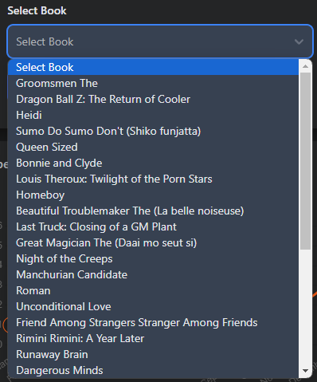

**Get the Frequency per Month in the Year 2023:**

```sql
SELECT
    DATE_FORMAT(`checkoutDates`, '%Y-%m') AS month,
    COUNT(*) AS `checkout_count`
FROM
    `checkout`
WHERE `checkoutDates` BETWEEN '2023-01-01' AND '2023-12-31'
GROUP BY
    YEAR(`checkoutDates`),
    MONTH(`checkoutDates`)
ORDER BY
    YEAR(`checkoutDates`) DESC,
    MONTH(`checkoutDates`) DESC;
```

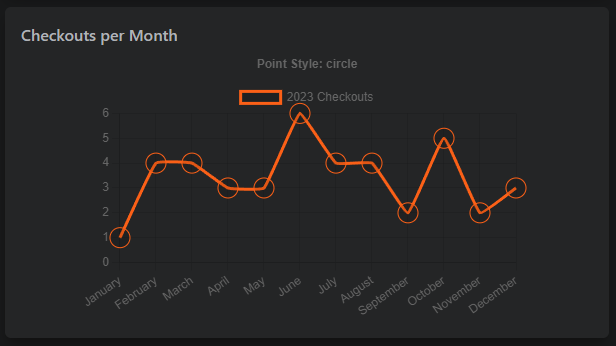

**Searching for Books:**

```sql
SELECT `book`.*, `checkout`.`ReturnDates`
FROM `book`
LEFT JOIN `checkout` ON `checkout`.`BookID` = `book`.`BookID`
WHERE `book`.`Title` = '$search';
```

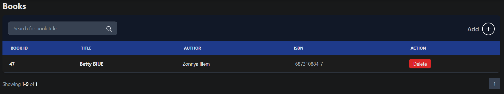

### Screenshots of Tables in the phpMyAdmin database

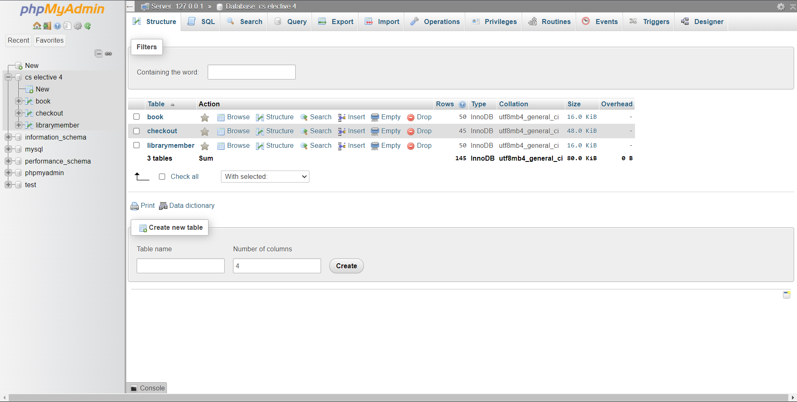

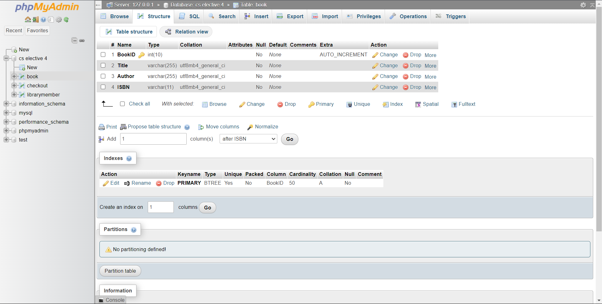

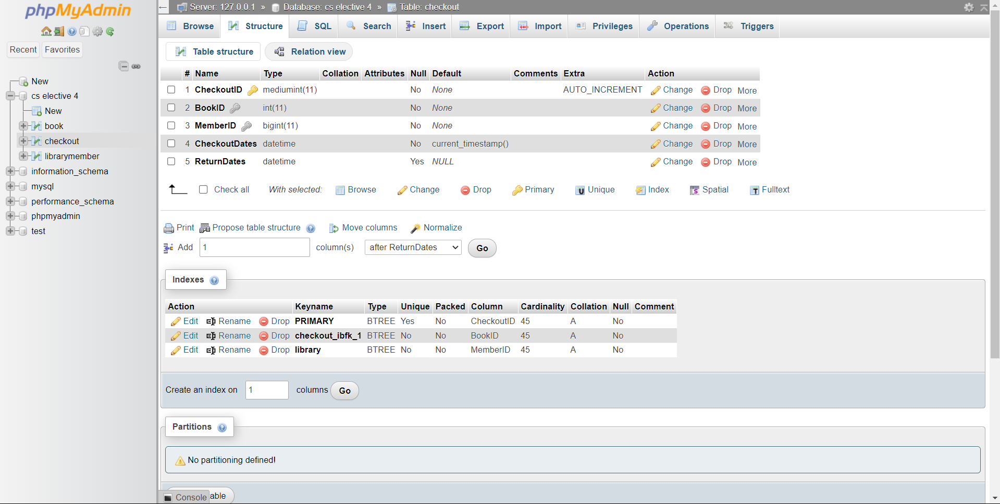

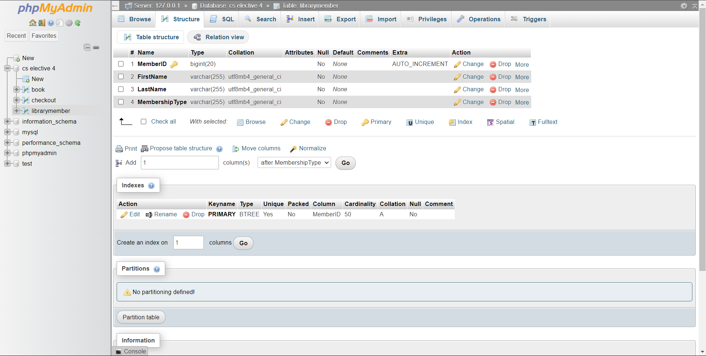

### Screenshots of the Website Pages

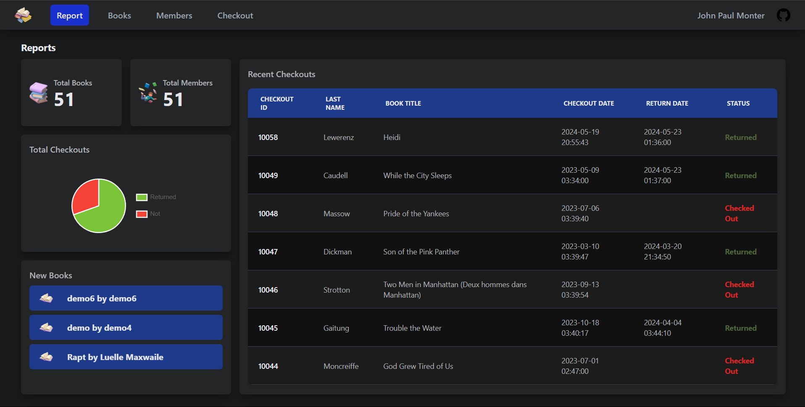

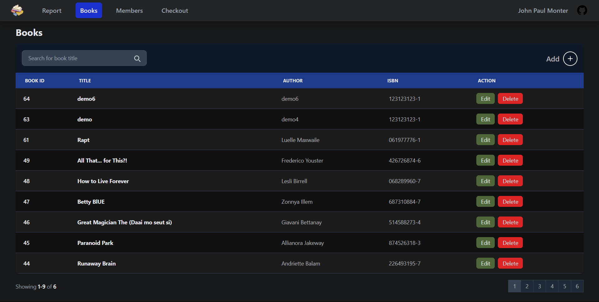

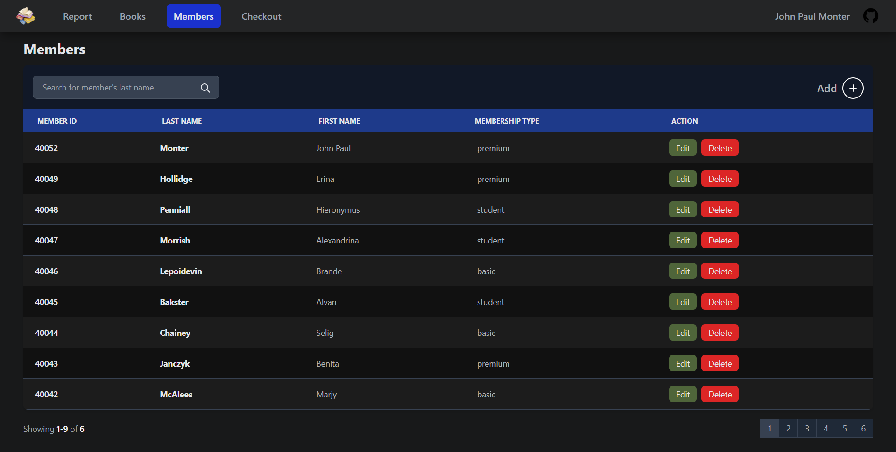

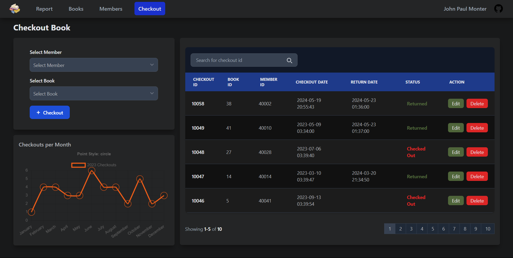

## Contributing

Contributions are welcome! Please fork this repository and submit pull requests with your changes.

## License

Copyright © 2024 John Paul Monter.
This project is MIT licensed.
